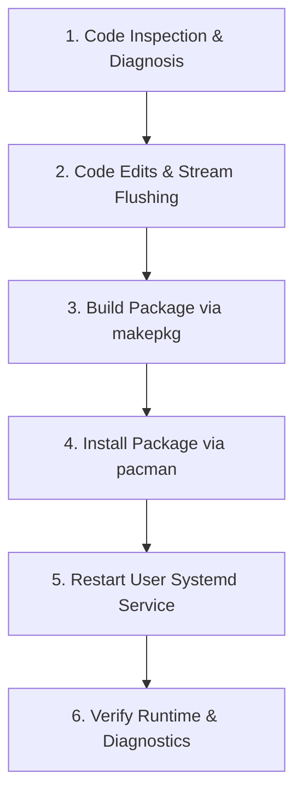

# Agent Development Guide (`AGENTS.md`)

This document outlines the standard workflow, step-by-step procedures, command order, and rules for AI agents and developers working on the `xconnect` repository.

---

## 1. Standard Step-by-Step Workflow

When developing, debugging, or extending `xconnect`, follow this exact sequence:



### Step 1: Code Inspection & Diagnosis
* Use search tools to locate exact methods (e.g. `device-proxy.vala`, `device.vala`, `devicechannel.vala`).
* Never infer definitions or schemas without inspecting the source file directly.
* Check active D-Bus bus owner and process ID:
  ```bash
  ps aux | grep xconnect
  ```

### Step 2: Code Modification & Best Practices
* Apply necessary logic changes.
* Ensure socket output streams explicitly call `.flush()` after writing (`this._dout.flush()`).
* Clear stale timer sources (`Source.remove (_pair_timeout_source)`) before assigning new timeouts to prevent memory leaks or premature flag resets.

### Step 3: Build Package
Compile the Vala/C code using `makepkg` directly in the project root:
```bash
cd /home/twilight/Projects/xconnect
makepkg -f --noextract --noprepare
```

### Step 4: Install Package
Install the built package:
```bash
echo "0374" | sudo -S pacman -U --noconfirm --overwrite "*" /home/twilight/Projects/xconnect/xconnect-app-2.0.1-1-x86_64.pkg.tar.zst
```

### Step 5: Restart User Daemon Service
Restart the background user systemd service:
```bash
systemctl --user restart xconnect
```

### Step 6: Empirical Runtime Verification
Verify status, execute test CLI commands, and inspect logs:
```bash
# Check service status
systemctl --user status xconnect --no-pager

# List discovered & connected devices
xconnectctl list

# Test pairing action
xconnectctl pair /org/xconnect/device/0

# Inspect journal logs
journalctl --user -u xconnect -n 50 --no-pager
```

---

## 2. Command Order Reference

When performing a full build, deploy, and test cycle, execute commands in this exact order:

```bash
# 1. Build package
cd /home/twilight/Projects/xconnect && makepkg -f --noextract --noprepare

# 2. Install package
echo "0374" | sudo -S pacman -U --noconfirm --overwrite "*" xconnect-app-2.0.1-1-x86_64.pkg.tar.zst

# 3. Restart daemon
systemctl --user restart xconnect

# 4. Wait for phone TCP auto-reconnect (5 seconds)
sleep 5

# 5. Execute test command
xconnectctl pair /org/xconnect/device/0

# 6. Verify via logs
journalctl --user -u xconnect -n 40 --no-pager
```

---

## 3. Mobile Device Diagnostics (ADB Commands)

When testing device interaction with connected Android phones over ADB:

```bash
# Check connected Android devices
adb devices

# Stream Android KDE Connect logs
adb logcat -s KdeConnect:* *:S

# Inspect Android notification record state
adb shell "dumpsys notification --package org.kde.kdeconnect_tp"

# Inspect Android active UI elements hierarchy
adb shell "uiautomator dump /sdcard/ui.xml && cat /sdcard/ui.xml"
```

---

## 4. Key Developer Rules & Constraints

1. **Never Declare Success Without Empirical Verification**:
   Running a code edit tool is not sufficient. You must run the build, reinstall, restart the service, and verify runtime output.
2. **D-Bus Session Isolation**:
   The `xconnect` daemon runs in the user systemd session (`DBUS_SESSION_BUS_ADDRESS=unix:path=/run/user/1000/bus`). Always manage and test against the running `xconnect.service` systemd unit to avoid spawning duplicate daemon processes.
3. **Explicit Stream Flushing**:
   Any socket output via `DataOutputStream` must be followed by `flush()` to prevent buffered packet delays over TLS.
